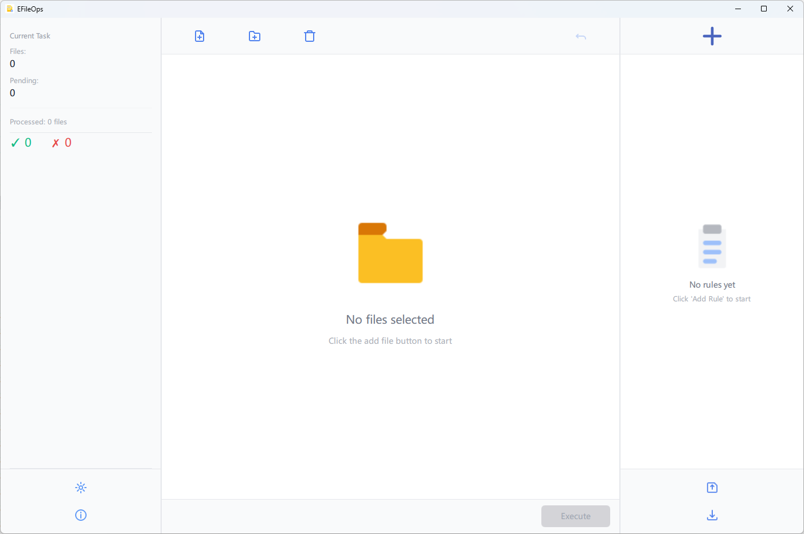

# EFileOps

A safe and minimal batch file renaming tool for Windows.
It supports complex renaming workflows through rule combinations, with preview and rollback mechanisms to ensure operation safety.

[中文说明](README_CN.md)

---

## Core Features

- Batch renaming of files and folders
- Rule-based renaming pipeline (executed sequentially)
- Side-by-side preview of original and new filenames
- Automatic rollback if any error occurs
- Clear success / failure statistics
- Supports Chinese, English, and German
- Offline usage (no network required)



---

## Build

Tested environment:

- Visual Studio 2022
- Qt 6.5.3+
- CMake 3.20+
- Python 3.10+

Build command:

```bash
cmake -B build -G "Visual Studio 17 2022" -A x64

cmake --build build --config Release

cmake --build build --config Debug
```

## License
This project is licensed under the **CC BY-NC 4.0 (Attribution-NonCommercial) License**.
You are free to:
- Use it for free
- Modify and learn from the source code
- Share it non-commercially
But you are not allowed to:
- Any commercial use
- Resell, distribute or use it in a profit product
The author reserves the right to commercialize this project.
For the full text of the license, please refer to the English version in LICENSE file.

## Support Project

if you find this tool helpful,
please consider supporting the project's continuous development by donating.
- Gumroad: https://baileydjoseph.gumroad.com/l/zufxto